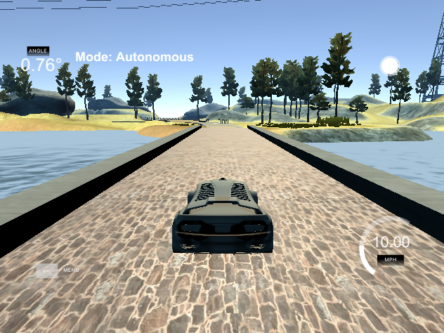

# **Behavioral Cloning**

## Writeup

---

**Behavioral Cloning Project**

---
### Files Submitted & Code Quality

#### 1. Submission includes all required files and can be used to run the simulator in autonomous mode

My project includes the following files:
* model.py containing the script to create and train the model
* drive.py for driving the car in autonomous mode
* model.h5 containing a trained convolution neural network
* writeup_report.md or writeup_report.pdf summarizing the results
* video.mp4 containing a video of my final model in action

#### 2. Submission includes functional code
Using the Udacity provided simulator and my drive.py file, the car can be driven autonomously around the track by executing
```sh
python drive.py model.h5
```

#### 3. Submission code is usable and readable

The model.py file contains the code for training and saving the convolution neural network. The file shows the pipeline I used for training and validating the model.

### Model Architecture and Training Strategy

#### 1. An appropriate model architecture has been employed
```python
model = Sequential()
model.add(Lambda(lambda x: x / 255.0 - 0.5, input_shape=(160,320,3)))
model.add(Cropping2D(cropping=((50,25),(0,0))))
model.add(Conv2D(24,(5,5),strides=(2,2),activation="relu"))
model.add(Conv2D(36,(5,5),strides=(2,2),activation="relu"))
model.add(Conv2D(48,(5,5),strides=(2,2),activation="relu"))
model.add(Conv2D(64,(3,3),activation="relu"))
model.add(Conv2D(64,(3,3),activation="relu"))
model.add(Flatten())
model.add(Dense(100,activation="relu"))
model.add(Dropout(0.3))
model.add(Dense(50,activation="relu"))
model.add(Dropout(0.3))
model.add(Dense(10,activation="relu"))
model.add(Dense(1))
```

My model is similar to the Nvidia architecture shown in the project instructions. It consists of a lambda layer for zero-basing, a cropping layer to shave 50 pixels from the top and 25 from the bottom, 5 Convolution layers, and 4 fully-connected layers. The convolution layers and fully-connected layers use relu activation functions. I also added two Dropouts to reduce the potential for overfitting.

#### 2. Attempts to reduce overfitting in the model

In addition to using dropout to prevent overfitting, I also relied on a large dataset and limited the number of epochs. My dataset included ~64,000 images (twice that if you include the flipped images for augmentation), of which ~24,000 were provided for us and the remainder I generated in the simulator.

#### 3. Model parameter tuning

The model used an adam optimizer, so the learning rate was not tuned manually. I experimented with mean absolute error vs. MSE after reading a comment that suggested it in the Slack channel for this project, but I ultimately used MSE because it seemed to give me slightly better performance.

#### 4. Appropriate training data

Most of my training data was "center-lane driving", though I did simulated runs at different speeds. Driving the car faster forced me to make recovery motions more often naturally. I did make one training set with intentional recoveries, but I excluded it from the final model because it resulted in a high level of oversteering.

### Model Architecture and Training Strategy

#### 1. Solution Design Approach

As described above, my architecture is identical to the Nvidia architecture.

I modified the number of epochs to deal with overfitting. I wanted to ensure that the training loss did not converge significantly faster than the validation loss. I also did not want to continue training epochs once the validation loss stopped improving.

After completing each training, I tested the new model on the simulator. My first test used only the provided data for training. This test resulted in the car drifting off the track. The most problematic areas were places where there was a dirt shoulder rather than a curb. I continued to add self-generated training data and saw gradual improvements. Once I got to ~50,000 images of training data, the car seemed to be able to reliably make its way around the track without incident.

#### 2. Final Model Architecture

The final model architecture did not change significantly from the initial architecture. The main thing I changed was adding more training data.

At the suggestion of my project reviewer, I re-trained the model after adding relu activation functions and dropouts to the fully-connected layer. I believe the performance of my model increased as a result, although it is difficult to tell.

#### 3. Creation of the Training Set & Training Process

Almost all of my included training runs were center-lane driving, although I tried driving at different speeds to create opportunities for recovery motions. I also did one training run in the opposite direction as suggested in the project instructions.

There were two training sets that I excluded because they seemed to make performance worse. One was from the jungle track. My thinking was that if I trained a sufficiently big model on both sets of data, the same model could drive on both tracks. This turned out not to be the case. The other set I excluded was a training run where I deliberately staged recovery motions. Including that set in the training data resulted in a final model that chronically oversteered.

Other techniques I used included:
* Using a generator to batch the data and conserve memory
* Flipping the images and angles to double the size of the data-set
* Using the left and right camera images with the angle corrections suggested in the project instructions

#### These images show some of the problem areas my model encountered:

Car getting to close to the edge


Car going out of bounds


#### However, in the end, the model was able to steer the car through even some of the more tricky areas:

Car going straight over bridge



Car making sharp turn near dirt shoulder area


Car making sharp turn in red-checked area


